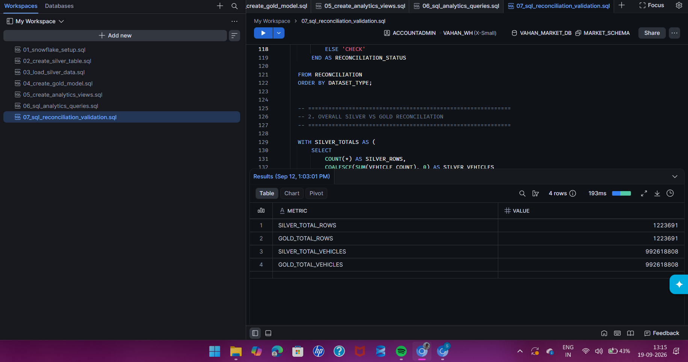
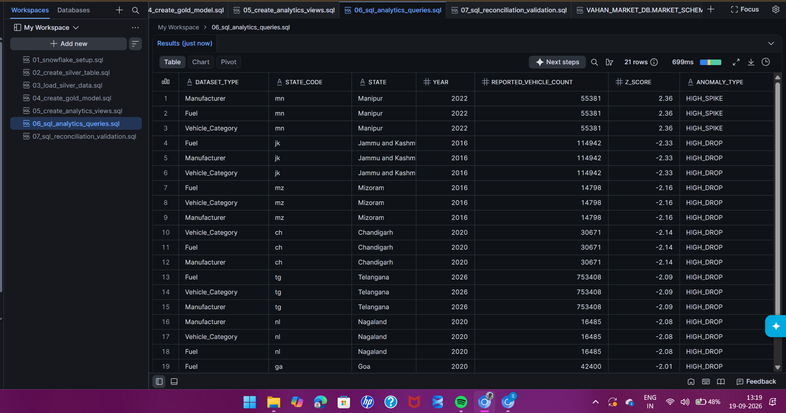
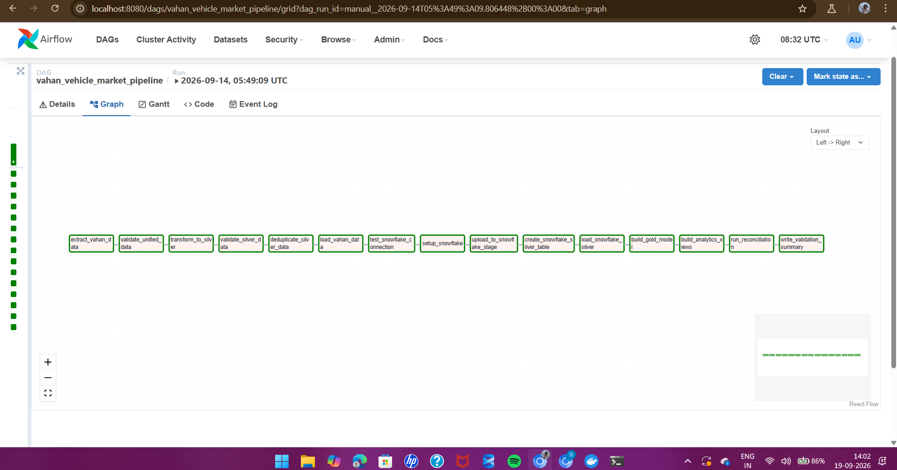
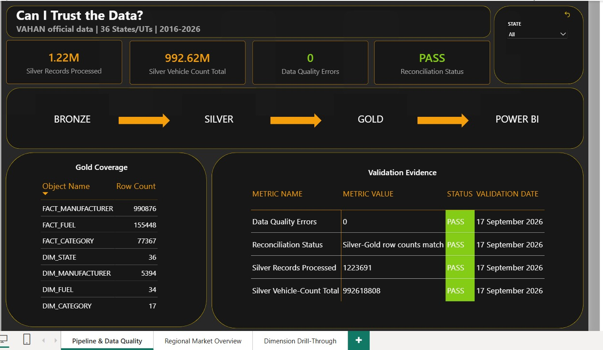
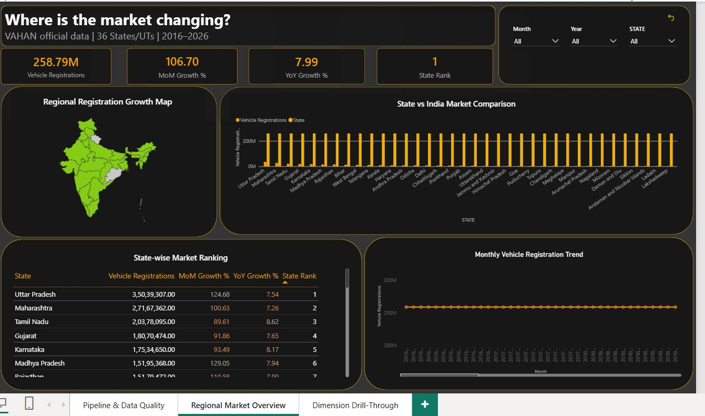
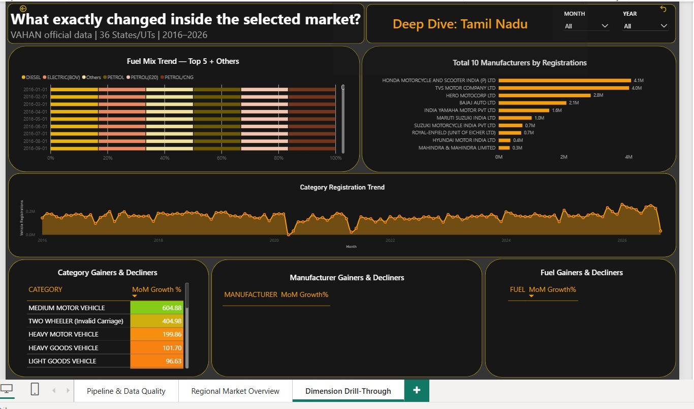
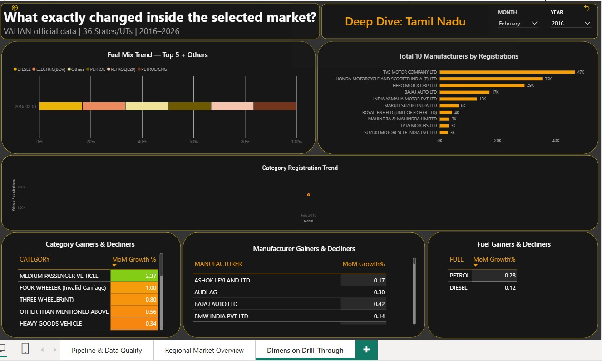

# VAHAN Regional Vehicle Market Intelligence Platform

End-to-end Data Engineering + Analytics pipeline built on official Government of India vehicle registration data — from raw extraction to a production-style Power BI dashboard, orchestrated with Apache Airflow and modeled in Snowflake.

**One-line summary:** I built an end-to-end Data Engineering pipeline using official VAHAN vehicle registration data to detect state-level registration anomalies and investigate correlated trends across vehicle category, fuel type, and manufacturer.

---

## Table of Contents
- [Business Problem](#business-problem)
- [Architecture](#architecture)
- [Data Source & Scope](#data-source--scope)
- [Data Quality Approach](#data-quality-approach)
- [Warehouse Model (Snowflake)](#warehouse-model-snowflake)
- [SQL Analytics Layer](#sql-analytics-layer)
- [Orchestration (Airflow)](#orchestration-airflow)
- [Power BI Dashboard](#power-bi-dashboard)
- [Repository Structure](#repository-structure)
- [Known Limitations & Design Decisions](#known-limitations--design-decisions)
- [Reproducing This Project](#reproducing-this-project)

---

## Business Problem

Vehicle registrations vary by state, month, category, fuel type, and manufacturer. This platform detects unusual state-level movements, then investigates what changed in the independent category, fuel, and manufacturer reports during the same period.

**Analytical story: Detect → Investigate → Correlate.**

> **Important limitation:** VAHAN provides separate marginal reports at different grains (Category, Fuel, Manufacturer) — not a single combined State × Category × Fuel × Manufacturer cross-tab. This project reports **correlated movement**, not causal attribution.

---

## Architecture

```
Official VAHAN Portal (analytics.parivahan.gov.in)
        │
        ▼
Selenium Extraction (manual CAPTCHA checkpoint)
        │
        ▼
BRONZE — Raw CSV files (unaltered source output)
        │
        ▼
Data Quality — pytest (structural) + SQL (value-level)
        │
        ▼
SILVER — Pandas standardization, dedup, wide→long
        │
        ▼
Apache Airflow — orchestration (Bronze consolidation → validate → transform → load → analyze)
        │
        ▼
Snowflake — staging → curated Gold model
        │
        ▼
GOLD — Dimensions + 3 source-grain Fact tables + analytics views
        │
        ▼
SQL Analytics Layer — 35 business/anomaly/correlation queries
        │
        ▼
Power BI — 3-page dashboard
```

> **Note on the extraction boundary:** Selenium (with the manual CAPTCHA checkpoint) is a standalone source-ingestion step, run separately to produce the Bronze CSV files. The Airflow DAG's `extract_vahan` task does **not** launch the browser — it consolidates the already-downloaded Bronze CSVs and hands off to validation. Airflow orchestrates everything from Bronze consolidation onward; it does not automate the live scrape.

---

## Data Source & Scope

| | |
|---|---|
| **Source** | Official VAHAN / Parivahan Analytics Portal |
| **Coverage** | 36 States/UTs, 2016–2026 |
| **Extraction method** | Python + Selenium |

The VAHAN portal has no public API and sits behind a CAPTCHA, so browser automation (Selenium) with a manual CAPTCHA checkpoint was the only viable extraction path — no anti-bot bypass is part of the project.

| Report Type | Coverage | Reports |
|---|---|---|
| Vehicle Category | 36 states × 4 year-chunks | 144 |
| Fuel | 36 states × 4 year-chunks | 144 |
| Manufacturer | 36 states × 11 individual years | 396 |
| **Core total** | | **684** |

684 core state-wise reports, out of 725 total delivered CSV files (the remainder are reference/test/all-India files).

**Known data finding:** Maharashtra manufacturer reports for 2019 and 2024 each contain one exact duplicate row for a single manufacturer. Raw Bronze data is left unchanged; the Silver layer removes exact duplicates and logs the issue rather than hiding it.

---

## Data Quality Approach

Enforced in **two layers**:

**Python (pre-load, `src/validation/`)** — structural/file-level checks on Bronze and Silver: schema and file checks (`validate_bronze.py`, `validate_manufacturer_bronze.py`, `test_bronze_quality.py`), Silver-layer checks before load (`validate_silver.py`, `validate_unified_vahan.py`, `validate_unified_data_quality.py`), and duplicate detection (`analyze_unified_duplicates.py`, `analyze_overlap_sources.py`) — this is how the Maharashtra duplicate above was found.

**SQL (post-load, in Snowflake)** — value-level checks on the curated warehouse: NULL and negative-value checks plus duplicate-row detection on every fact table (`sql/04_gold_model.sql`), and Silver-vs-Gold row/vehicle-count reconciliation (`sql/07_silver_gold_reconciliation.sql`).

**Eight documented checks:** schema validation, NULL detection, duplicate detection, negative-value detection, state-code validation, year/month validation, monthly-sum-vs-Total reconciliation, row-count reconciliation.

**Result:** 0 data quality errors, Silver-to-Gold reconciliation status **PASS** (1,223,691 rows / 992,618,808 vehicles matching exactly on both sides).



---

## Warehouse Model (Snowflake)

Separate fact tables by design — Category, Fuel, and Manufacturer reports represent different source grains, and forcing them into one fact table would imply a relationship the source data doesn't actually support.

```
DIM_STATE ─┬── FACT_CATEGORY
           ├── FACT_FUEL
           └── FACT_MANUFACTURER

DIM_DATE, DIM_CATEGORY, DIM_FUEL, DIM_MANUFACTURER each join to their matching fact table.
```

| Object | Role |
|---|---|
| `DIM_DATE` | Date / month / year / quarter reference |
| `DIM_STATE` | State code and name (shared across all facts) |
| `DIM_CATEGORY`, `DIM_FUEL`, `DIM_MANUFACTURER` | Dimension references |
| `FACT_CATEGORY` | State + Date + Category + Vehicle Count |
| `FACT_FUEL` | State + Date + Fuel + Vehicle Count |
| `FACT_MANUFACTURER` | State + Date + Manufacturer + Vehicle Count |
| `PIPELINE_VALIDATION_SUMMARY` | DQ/reconciliation metrics, consumed directly by Power BI Page 1 |

---

## SQL Analytics Layer

35 business/analytics queries (`sql/06_sql_analytics_queries.sql`) plus 19 reusable analytics views (`sql/05_analytics_views.sql`):

- **Basic analytics** — totals by state, monthly trend, top categories/fuels/manufacturers
- **Advanced SQL** — MoM/YoY growth, window-function ranking, rolling trends
- **Anomaly & correlation** — state-level z-score anomaly detection, high-priority anomaly filtering, Category–Fuel / Fuel–Manufacturer / Category–Manufacturer correlated-movement queries



---

## Orchestration (Airflow)

Airflow runs inside Docker (`Dockerfile` + `docker-compose.yml`), so the scheduler, webserver, and metadata database spin up as containers rather than a local install.

A single DAG runs the downstream pipeline end to end: Bronze consolidation → validation → Silver transform → dedup → load → Snowflake staging → Gold model build → analytics views → reconciliation → validation summary write. Tested and running successfully across multiple end-to-end runs.

The DAG is **manually triggered** (`schedule=None`), not on a fixed calendar schedule. This is intentional: the upstream Selenium extraction requires a manual CAPTCHA checkpoint, so a fully automated monthly schedule wouldn't reflect how the pipeline is actually run — the Bronze data is refreshed manually, then the DAG is triggered to process it.



---

## Power BI Dashboard

Theme: **Warm Graphite + Electric Amber.**

### Page 1 — Pipeline & Data Quality ("Can I trust the data?")
KPI cards, Bronze→Silver→Gold→Power BI flow, Gold Coverage table, Validation Evidence table.



### Page 2 — Regional Market Overview ("Where is the market changing?")
India map colored by growth, State vs India comparison, State-wise Market Ranking, monthly trend.



### Page 3 — Dimension Drill-Through ("What exactly changed inside the selected market?")
Deep dive into a selected state: Fuel Mix Trend, Top 10 Manufacturers, Category Registration Trend, Gainers & Decliners.




---

## Repository Structure

```
Vahan-Regional-Market-Intelligence/
├── dags/                    # Airflow DAG definition
├── src/
│   ├── extraction/          # Selenium extraction scripts
│   ├── transformation/      # Silver-layer Pandas transforms, dedup
│   ├── loading/              # Snowflake load scripts
│   └── validation/           # Python DQ checks (pytest + custom scripts)
├── sql/
│   ├── 01_snowflake_setup.sql
│   ├── 02_create_silver_table.sql
│   ├── 03_load_silver_data.sql
│   ├── 04_gold_model.sql
│   ├── 05_analytics_views.sql            # 19 views
│   ├── 06_sql_analytics_queries.sql      # 35 business/anomaly/correlation queries
│   └── 07_silver_gold_reconciliation.sql
├── Dashboard/
│   └── VAHAN_Market_Intelligence.pbix
├── docs/
│   └── screenshots/          # Evidence screenshots used in this README
├── Dockerfile                # Airflow container image
├── docker-compose.yml        # Airflow webserver + scheduler + metadata DB
├── requirements.txt
├── .env.example
└── .gitignore
```

---

## Known Limitations & Design Decisions

- **Two date tables in the Power BI model** (`DIM_DATE` from source, `DateTable` calculated via `CALENDAR()`). Each fact table's measures reference whichever date table it has an active relationship to. Tested and functionally correct — documented technical debt, consolidation to a single date table is a noted future improvement.
- **MoM/YoY growth guards** — return `BLANK()` instead of a misleading 0% or inflated percentage when no specific period is selected, or the prior period has no data (e.g. the dataset's first month, January 2016). Manufacturer/Fuel growth measures additionally guard against near-zero-base outlier percentages.
- **No causal claims** — the dashboard describes correlated, same-period movement, not attribution or causation.
- **No fabricated or hidden data** — all edge-case behavior (blanks, duplicate handling, reconciliation status) is intentional and explainable.

---

## Reproducing This Project

1. `docker-compose up -d` — brings up the Airflow environment (webserver, scheduler, metadata DB).
2. Configure Snowflake credentials locally (see `.env.example` — never commit real credentials).
3. Trigger the `vahan_vehicle_market_pipeline` DAG from the Airflow UI (`localhost:8080`).
4. Once the pipeline completes, connect Power BI to the 9 curated Snowflake objects (5 dimensions + 3 facts + `PIPELINE_VALIDATION_SUMMARY`) and open `Dashboard/VAHAN_Market_Intelligence.pbix`.

> Note: this repository ships a small sample of Bronze data for structure reference. Full-scale extraction requires running the Selenium scripts against the live VAHAN portal, including the manual CAPTCHA checkpoint.
